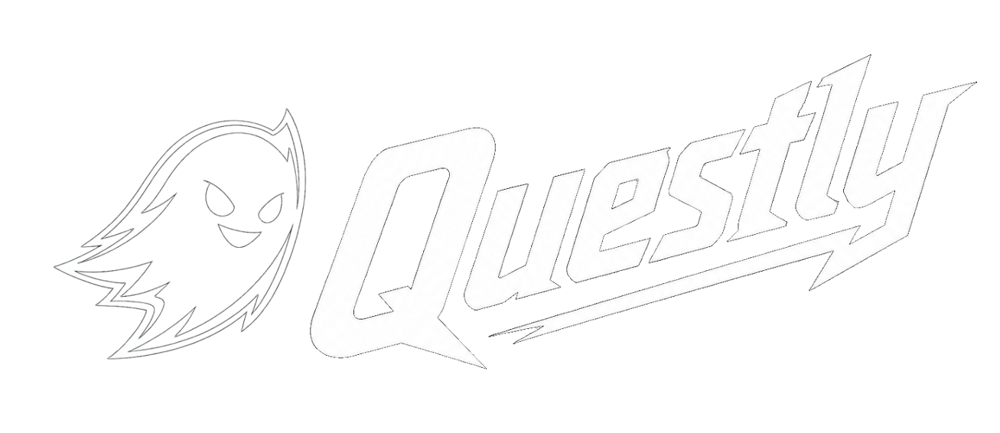

<p align="center">
  
</p>


<p align="center">
  A multi-game companion app for tracking quests, achievements, items, and map markers.
</p>

---


---

### **Questly** is a multi-game companion app for tracking **quests, achievements, items, and interactive map markers**.

I love playing games, and when I do, I like to complete as much as possible - quests, achievements, collectibles, and everything else a game has to offer.

The problem was finding a companion app that actually worked the way I wanted. Some were paid, some were missing important features or useful quality-of-life options, and I often had to use multiple apps to keep track of everything.

I wanted something simple: **one app for everything**.

That's how **Questly** was born - a flexible multi-game companion designed to bring quests, achievements, items, and interactive maps together in one place.

🌐 [questly-tracker.vercel.app](https://questly-tracker.vercel.app/)

###### Built with **Next.js** and **Strapi CMS**.

---

## ✨ Features

* 📜 **Quest Tracker** - keep track of active, completed, and unfinished quests
* 🏆 **Achievement Tracker** - track achievements and completion progress
* 🎒 **Item Collection** - manage collectibles and other in-game items
* 🗺️ **Interactive Maps** - explore game worlds and track map markers
* 🎮 **Multi-game Support** - designed to work with multiple games from a single application
* 🌍 **Internationalization** - multilingual interface powered by `next-intl`
* ☁️ **Headless CMS** - game content is managed through Strapi CMS and exposed via GraphQL


---

## 📸 Screenshots


---


---


---


---


---


---

## 🛠️ Tech Stack

### Frontend

| Technology                                                   | Purpose               |
| ------------------------------------------------------------ | --------------------- |
| [Next.js](https://nextjs.org/)                               | React framework       |
| [React](https://react.dev/)                                  | UI library            |
| [Apollo Client](https://www.apollographql.com/docs/react/)   | GraphQL data fetching |
| [Leaflet](https://leafletjs.com/)                            | Interactive maps      |
| [Radix UI](https://www.radix-ui.com/)                        | UI components         |
| [Framer Motion](https://motion.dev/)                         | Animations            |
| [Lucide React](https://lucide.dev/)                          | Icons                 |
| [next-intl](https://next-intl.dev/)                          | Internationalization  |
| [Fuse.js](https://www.fusejs.io/)                            | Fuzzy search          |
| [React Markdown](https://github.com/remarkjs/react-markdown) | Markdown rendering    |

### Backend & CMS

| Technology                      | Purpose        |
| ------------------------------- | -------------- |
| [Strapi](https://strapi.io/)    | Headless CMS   |
| [GraphQL](https://graphql.org/) | API            |

---

## 🏗️ Architecture

Questly is split into two main applications:

```text
┌─────────────────────┐
│      Next.js        │
│       Frontend      │
│                     │
│  Quests             │
│  Achievements       │
│  Items              │
│  Interactive Maps   │
│  Markers            │
└──────────┬──────────┘
           │
        GraphQL
           ↕
┌─────────────────────┐
│       Strapi        │
│     Headless CMS    │
│                     │
│  Game Content       │
│  Quests             │
│  Items              │
│  Achievements       │
│  Locations          │
└──────────┬──────────┘
           │
       Media Assets
           ↓
┌─────────────────────┐
│   Cloudflare R2     │
│    Object Storage   │
└─────────────────────┘
```

The **Next.js frontend*** communicates with **Strapi** through GraphQL. 
**Strapi** manages the game content, while media assets such as game images are stored in **Cloudflare R2**.

---

## 📦 Installation
⚠️ **Important:** An external object storage is required for media assets.

### 1. Clone the repository

```bash
git clone https://github.com/PawelRomik/Questly.git
cd questly
```

### 2. Install and run the Strapi backend

```bash
cd questly_db
npm install
npm run develop
```

Strapi will start the development server and provide access to the CMS and API.

### 3. Environment variables

The project requires a Strapi instance and an external object storage for media assets.

Create a `.env.local` file in the `questly` directory:

```env
NEXT_PUBLIC_STORAGE_URL-your_storage_url
NEXT_PUBLIC_CMS_URL-http://localhost:1337/graphql
```

- `NEXT_PUBLIC_STORAGE_URL` — URL of the external object storage used for media assets.
- `NEXT_PUBLIC_CMS_URL` — URL of the Strapi GraphQL API.

Adjust the values according to your environment.


### 4. Install and run the Next.js frontend

In another terminal:

```bash
cd questly
npm install
npm run dev
```

The frontend will be available at:

```text
http://localhost:3000
```


---

## 📄 License

This project is for educational and personal use.

---

<p align="center">
  Built with ❤️ using Next.js & Strapi
</p>
